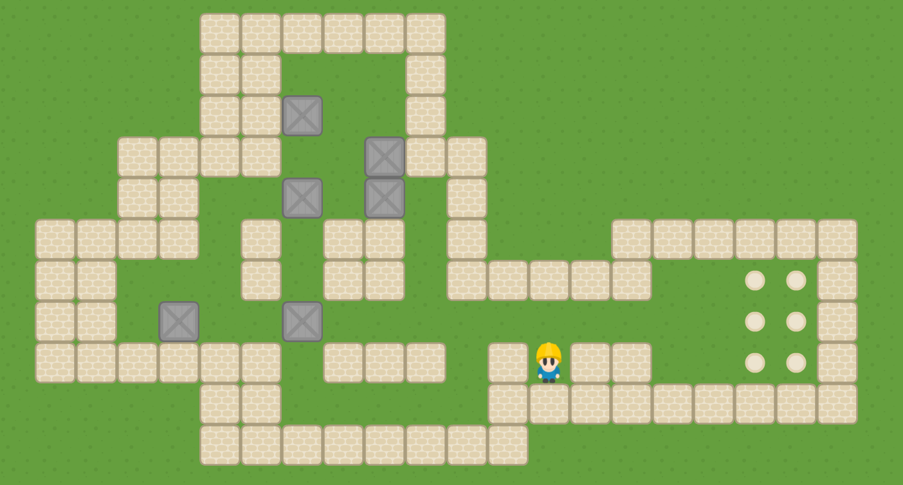

# Sokoban Game written in C++11 and SFML

## Authors:
- Giorgio Caculli
- Guillaume Lambert
- Tanguy Taminiau
- Nathan Thaon

## Dependencies
- [SFML 2.5.1](https://www.sfml-dev.org/)
- [Boost](https://www.boost.org/)
- [GzC Sokoban Core](https://www.gitlab.com/GiorgioCaculli/Sokoban-Cpp)
- [GzC Utils](https://www.gitlab.com/GiorgioCaculli/Util-Cpp)

## Build Tools:
- [CMake](https://cmake.org/)
- [Autotools](https://www.gnu.org/software/software.html)

## Building Instructions:

### Autotools
1. mkdir build
2. cd build
3. autoreconf -fiv ../Sokoban
4. ../Sokoban/configure
5. make

### CMake
1. mkdir build
2. cmake ../Sokoban
3. make
