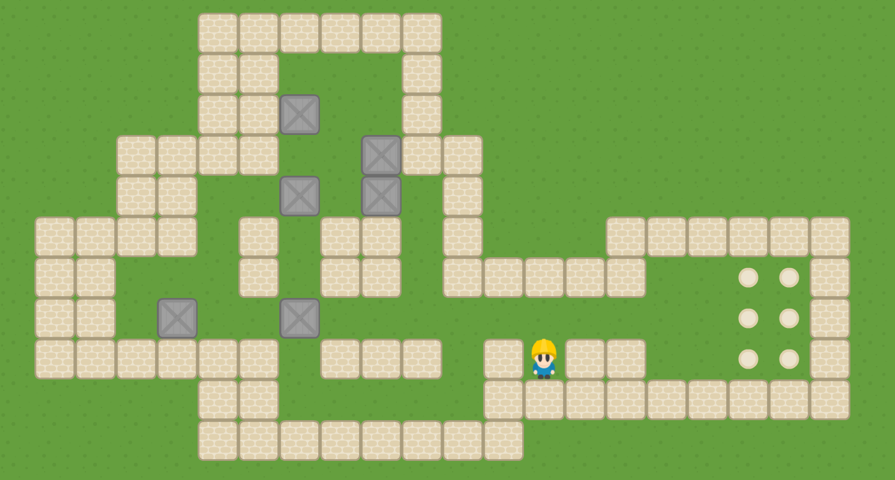

# Sokoban Game written in C++20 and SFML 3

## Authors:
- Giorgio Caculli <[giorgio.caculli@icloud.com](mailto:giorgio.caculli@icloud.com)>
- Guillaume Lambert
- Tanguy Taminiau
- Nathan Thaon

## Dependencies
- [SFML 3.0.1](https://www.sfml-dev.org/)
- [Boost Filesystem](https://www.boost.org/doc/libs/1_89_0/libs/filesystem/doc/index.htm)
- [GzC Sokoban Core](https://www.gitlab.com/GiorgioCaculli/Sokoban-Cpp)
- [GzC Utils](https://www.gitlab.com/GiorgioCaculli/Util-Cpp)

## Build Tools:
- [CMake](https://cmake.org/)

## Building Instructions:

### CMake
1. `mkdir build`
2. `cd build`
3. `cmake ..`
4. `make`
5. `./Sokoban`
